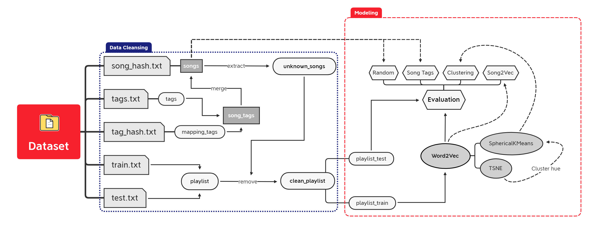
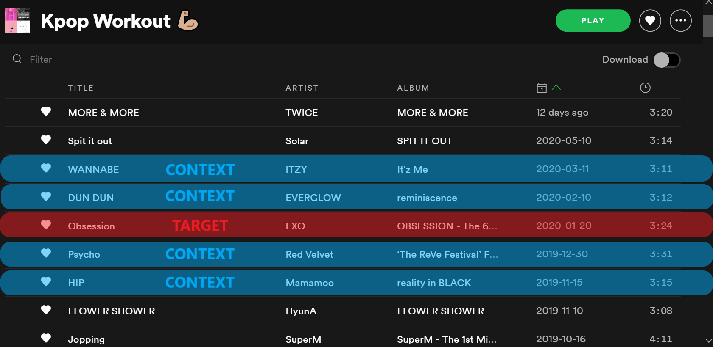

# Yes Song Recommender

The behavior of musicophiles has changed along with the evolvement of the music industry in the past decades. Previously we conservatively bought music on a compact disc, but now music streaming services are more preferable; such as Amazon Music, Apple Music, Google Play Music, Pandora, Spotify, Youtube Music, to name a few. This is because of the convenience offered by these platforms so that users are able to search their favorite songs right away without having to bother going to the music store physically.

Users may not have enough time to scan through all available songs and manually create a playlist. Instead, a recommender system is constructed which eases them to find relevant songs quickly. One example you might seen before is the "Made For You" feature from Spotify:


These personalized playlists are being recommended by grouping similar songs that go well together. How? In the real case, this process is done by combining several recommender algorithms, simply based on users' activities such as likes, playlist history, or even listening history. In this tutorial, we will demonstrate how to extract song embeddings using a neural network approach specifically Word2Vec model, use it to generate songs recommendation, and evaluate the performance.

In this tutorial, human-made music playlists collected by Shuo Chen from Cornell University are used to learn the song embeddings. The dataset contains US radio playlists from [Yes.com](http://yes.com/) and songs tag from [Last.fm](http://last.fm/) since December 2010 to May 2011. Each playlist will be treated as a sentence and each song in the playlist will be treated as one word.



## Model - Word2vec CBOW

Note: CBOW is used instead of Skip-gram, because according to [Google Code Archive](https://code.google.com/archive/p/word2vec/), it trains faster and able to capture the frequent songs more.



Target song that are played between context songs is assumed to be similar (remember that when we say similar, it means relevant) to each other. If the playlist are designed by users or the services for certain genre, the song embeddings will logically incorporate more information about the genre.

## Dataset
[Yes.com](http://yes.com/) is a website that provides radio playlists from hundreds of radio stations in the United States. By using the web based API [http://api.yes.com](http://api.yes.com/), one can retrieve the playlist record of a specified station for the last 7 days. We collected as many playlists as possible by specifying all possible genres and getting playlists from all possible stations. The collection lasted from December 2010 to May 2011. This lead to a dataset of 75,262 songs and 2,840,553 transitions. To get datasets of various sizes, we pruned the raw data so that only the songs with a number of appearances above a certain threshold are kept. We then divide the pruned set into a training set and a testing set, making sure that each song has appeared at least once in the training set. We name them as yes_small, yes_big and yes_complete, whose basic statistics are shown below.

```
                               yes_small       yes_big       yes_complete
Appearance Threshold           20              5             0
Number of Songs                3,168           9,775         75,262
Number of Train Transitions    134,431         172,510       1,542,372
Number of Test Transitions     1,191,279       1,602,079     1,298,181
```

## Project structure
```
.
├── code
│   ├── __init__.py
│   └── nbs
│       ├── reco-tut-ysr-01-data-ingestion.py
│       ├── reco-tut-ysr-02-preprocessing.py
│       ├── reco-tut-ysr-03-modeling.py
│       └── reco-tut-ysr-04-recommendations.py
├── data
│   ├── bronze
│   │   ├── song_hash.txt
│   │   ├── tag_hash.txt
│   │   ├── tags.txt
│   │   ├── test.txt
│   │   └── train.txt
│   ├── gold
│   │   ├── playlist_test.pickle
│   │   └── playlist_train.pickle
│   └── silver
│       ├── clean_playlist.pickle
│       └── songs.pickle
├── docs
├── images
│   └── anim_song2vec_average.gif
├── LICENSE
├── model
│   ├── song2vec.model
│   ├── song2vec.model.trainables.syn1neg.npy
│   └── song2vec.model.wv.vectors.npy
├── notebooks
│   ├── reco-tut-ysr-01-data-ingestion.ipynb
│   ├── reco-tut-ysr-02-preprocessing.ipynb
│   ├── reco-tut-ysr-03-modeling.ipynb
│   └── reco-tut-ysr-04-recommendations.ipynb
└── README.md
```

Song2Vec is an implementation of Word2Vec which able to capture the context of a song based on surrounding songs in a playlist. In this notebook, we successfully exploit the sequential property of a playlist and represent each song with a 256-dimensional vector. This vector representation is then used as a recommender system based on cosine similarity score. The objective of a music recommender is to create accurate personalized recommendations from historical playlist or listening queue. Therefore, metric such as AHR@n is used to evaluate how many times (on average) a song is listed on the top-nn recommended songs based on surrounding context songs.

Things to be taken carefully when applying Song2Vec on its own is the cold start problem, a condition where it is impossible to recommend any songs to a new user or even recommend a new song to any users. This can be efficiently handled by combining the recommender using a content-based technique, which utilizes explicit features or characteristics of the songs as demonstrated in the "Song Tags Recommender" section.

Maybe you're wondering what are other implementations of Word2Vec? Here is the list for you:

- Product recommendations: Using purchase receipts in a transaction to capture an item embeddings to learn the user's purchase activity.
- Listing recommendations: The user activity is in the form of click data, which can be represented as a sequence of listings that a user viewed.
- Matching advertisement to search query: Data consist of sequential search sessions, including entered query, clicked advertisement, and search results.